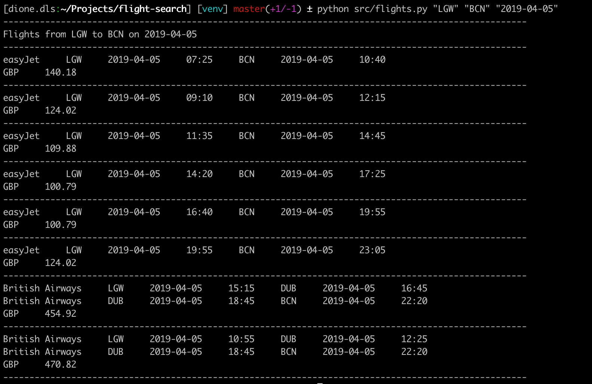
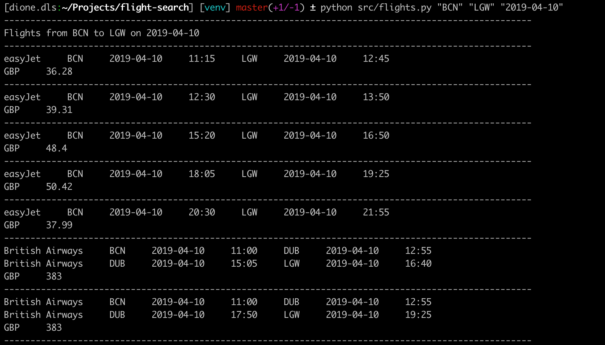
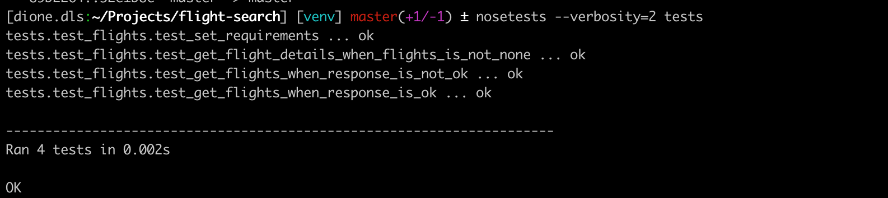

## A Simple Script to Search for Flights

Given the following user story:

    As a user, I want the ability to see all avaialble flights by providing the following details:
        - departure airport
        - arrival airport
        - departure date

## Approach and Scope

I have opted to write the script to call the Kyte API using __*Python3*__ with __*nose*__ and __*unittest*__ as a testing framework. 

It must be noted that the results of the API call displays one-way fares for one passenger only and that the results of the call is unordered as to date, time, flight duration, or price.

Also, departure/arrival airports are specified based IATA airport codes.

### Getting Started

Note: Before running the program, please make sure that Python3 is available in your machine and to specifically switch to this version. Python3 is available to download here: <https://www.python.org/downloads/>

Using your command line, clone the repository to your local machine:

```sh
$ git clone git@github.com:dione-dls/flight-search.git
```
Switch to the cloned repo and and run the following commands:

```sh
$ python3 -m pip install --user --upgrade pip
$ python3 -m pip install --user virtualenv
```
Create a virtual env by running:

```sh
$ python3 -m virtualenv venv
```
Activate the virtual environment:

```sh
$ source venv/bin/activate
```
Install the following modules by running the following commands:

```sh
$ pip3 install nose
$ pip3 install requests
```

Finally, go to the __*constants.py*__ and input your API Key to gain access to Kyte's API.

### Retrieving Flight Details

Below is an example of the command to run on your terminal to get the flight details.

In this case, the first argument "LGW" represents the departure airport, the second argument "BCN" represents the arrival airport, and the last argument "2019-04-05" represents the departure date.
```sh
$ python src/flights.py "LGW" "BCN" "2019-04-05"
```


As another example, searching for a return flight from Barcelona to London on 2019-04-10 yields the following results:


### Running the test

Run this command on your terminal:

```sh
$ nosetests --verbosity=2 tests
```
The following illustrates the test results after the unit tests have run:

